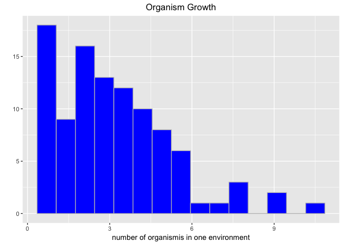

README
================

Evolution in R
==============

Introduction
------------

We want to create a simple evolution simulation in R. We will create a very rudumentary environment, with temperature and food, in which a 'organism' will live and reproduce. The organism reproductive success will depend on the adaptation to the enviromental parameters.

Setup
-----

Create Environment Model Class
------------------------------

We want to use R6 classes to represent out environment

``` r
EvoEnvironment <- R6Class("EvoEnvironment",
                          public = list(
                            temperature = NULL,
                            nutrients = NULL,
                            initialize = function(temperature = NA, nutrients = NA) {
                              self$temperature <- temperature
                              self$nutrients <- nutrients
                            },
                            set_temperature = function(val) {
                              self$temperature <- val
                            },
                            set_nutrients = function(val) {
                              self$nutrients <- val
                            }
                          )
)
```

Create environment
------------------

Up to now there seems to be no way, to create data.frames or matrixes with custom S4 or R6 objects.

``` r
#sample(100, 1, replace = TRUE)
#env2 <- EvoEnvironment$new(sample(40, 1, replace = TRUE), sample(100, 1, replace = TRUE))
EnvList <- list()

for(i in 1:100) {
 EnvList[[i]] <- EvoEnvironment$new(sample(40, 1, replace = TRUE), sample(100, 1, replace = TRUE))
}
```

Create our first organism
-------------------------

The first organism has growth rate dependent on the temperature and nutrients of the environment. In this first try, nutrients will not be depleted by the organism

``` r
source("gaussie.R")
EvoOrganism <- R6Class("EvoOrganism",
                       public = list(
                         tempOpt=NULL,
                         nutrientMin=NULL,
                         orgCount=NULL,
                         growthrate=NULL,
                         envNutrient = NULL,
                         envTemperature = NULL,
                         initialize=function(tempOpt=NA,nutrientMin=NA,orgCount=NA,growthrate=NA, envTemperature=NA,envNutrient=NA){
                           self$tempOpt <- tempOpt
                           self$nutrientMin <- nutrientMin
                           self$orgCount <- orgCount
                           self$growthrate <- growthrate
                           self$tempOpt <- tempOpt
                           self$nutrientMin <- nutrientMin
                           self$envTemperature <- envTemperature
                           self$envNutrient <- envNutrient
                         },
                         set_orgCount=function(val) {
                           self$orgCount <- val
                         },
                         set_tempOpt=function(val) {
                           self$tempOpt <- val
                         },
                         set_nutrientMin=function(val) {
                           self$nutrientMin <- val
                         },
                         set_growthrate=function(val) {
                           self$growthrate <- val
                         },
                         set_envTemperature=function(val) {
                           self$envTemperature <- val
                         },
                         set_envNutrient=function(val) {
                           self$envNutrient <- val
                         },
                         get_envNutrient=function() {
                           return(self$envNutrient)
                         },
                         get_nutrientMin=function() {
                           return(self$nutrientMin) 
                         },
                         get_envTemperature=function() {
                           return(self$envTemperature)
                         },
                         get_tempOpt=function() {
                           return(self$tempOpt) 
                         },
                         determineGrowthrate = function() {
                           paramTemp <-  private$determineTempParam()
                           paramNutrie <- private$determineNutrientParam()
                           self$growthrate <- paramTemp * paramNutrie + 1
                           cat(paste0("paramtemp: ",paramTemp, " paramNutrie: ",paramNutrie,".\n"))
                         },
                         determineOrgCount = function() {
                           self$orgCount = self$orgCount * self$growthrate
                           cat(paste0("orgCount: ",self$orgCount, ".\n"))
                         }
                       ),
                       private = list(
                         determineTempParam = function() {
                           if(self$envTemperature > 0){
                             t1 <- abs(self$envTemperature/self$tempOpt)
                             return(t1)
                           }
                           else{
                             return(0)
                           }
                         },
                         determineNutrientParam = function() {
                           if(self$envNutrient > self$nutrientMin-1) {
                             return(abs(self$envNutrient/self$nutrientMin))
                           } else {
                             return(0)
                           }
                         }
                       )
                       
                       
                       
                       
)
```

Our first live cycle
--------------------

### Create list of organism. The length of this list is the same as that of the environment list.

``` r
OrgList <- list()

for (j in 1:length(EnvList) ) {
  OrgList[[j]] <- EvoOrganism$new(tempOpt = 20, nutrientMin = 20, orgCount = 1)
}
```

### Read the envirnonment data

Read the environment data and let the organism grow

### first Evaluation - a frequency distribution of organism counts



Evolution with temperature Gauss function
-----------------------------------------

``` r
gaussie <- function(x, mw, sd) {
  y = (1/(sd*sqrt(2*pi)))*exp(-((x-mw)^2/sd^2))
  return(y)
}
```

Evolution with nutrient logistic function: the organismcount is supposed to double when it has enough nutrients
---------------------------------------------------------------------------------------------------------------

``` r
loggie <- function(x, growthoptimum) {
  c = 0.1 # experimentally found constants
  d = 0.25
  maxgrowth = 2 # in optimom conditions I want to have double growth rate
  y = maxgrowth/(1+c*exp(-(x-growthoptimum)*d))
  return(y)
}
```

EvoOrganism using this gaussian function to calculate growth rate
-----------------------------------------------------------------

``` r
library("R6")
source("gaussie.R")
source("loggie.R")
EvoOrganismGauss <- R6Class(
  "EvoOrganismGauss",
  inherit = EvoOrganism,
  
  private = list(
    determineTempParam = function() {
      tx <- super$get_envTemperature()
      tmw <- super$get_tempOpt()
      tsd <- 10
      if (tx > 0.001) {
        t0 <- gaussie(tx, tmw, tsd)
        cat(paste0("gaussie: ", t0, ".\n"))
        t1 <- t0 * 100
        return(t1)
      }
      else{
        return(0)
      }
    },
    determineNutrientParam = function() {
      nx <- super$get_envNutrient()
      ngrowthopt <- super$get_nutrientMin()
      if (nx > 0) {
        n1 <- loggie(nx, ngrowthopt)
        return(n1)
      }
      else{
        return(0)
      }
    }
  )
  
)
```

### Create list of our 'gaussian' organism. The length of this list is the same as that of the environment list.

``` r
OrgListGauss <- list()

for (j in 1:length(EnvList) ) {
  OrgListGauss[[j]] <- EvoOrganismGauss$new(tempOpt = 20, nutrientMin = 20, orgCount = 1)
}
```

### Gaussian growth

### first Evaluation - a frequency distribution of gaussian organism counts


let the orgs mutate- simple mutation of the optimal temperature
---------------------------------------------------------------

``` r
mutie <- function(mw) {
  p <- c(0.01, 0.05, 0.88, 0.05, 0.01)
  upper_limit = mw + 2
  lower_limit = mw - 2
  return(sample(lower_limit:upper_limit, 1, replace = T, prob = p))
}
```

Create list for our 'gaussian' organism that is able to mutate. The length of this list is the same as that of the environment list.
------------------------------------------------------------------------------------------------------------------------------------

``` r
MutieOrgListGauss <- list()

for (l in 1:length(EnvList) ) {
  MutieOrgListGauss[[l]] <- EvoOrganismGauss$new(tempOpt = 20, nutrientMin = 20, orgCount = 1)
}
```

### Gaussian growth with mutation

### Evaluation - a frequency distribution of gaussian organism counts with mutation

 \#\#\# plot the org count on NC map

``` r
nc <- sf::st_read(system.file("shape/nc.shp", package = "sf"), quiet = TRUE)

orgCount <- lapply(OrgListGauss, function(x) x$orgCount)
oo <-unlist(orgCount)
nc$orgCount <- oo
ggplot(nc) + geom_sf(aes(fill = orgCount)) + theme(plot.title = element_text(hjust = 0.5)) + ggtitle("OrgCount")
```


